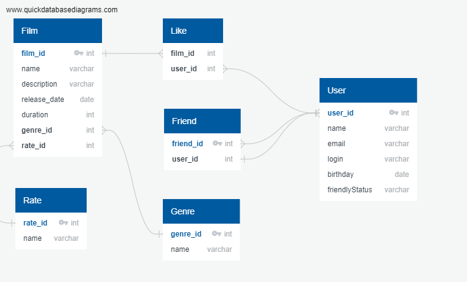

# java-filmorate
Third project homework Y.P.

## Это репозиторий проекта "Фильмография"  
#### Он позволяет работать с поиском фильмов в БД, отмечать их, взаимодействовать с другими пользователями.

Наше приложение **умеет**:
1. Добавлять фильмы, ставить им лайки. 
2. Добавлять пользователей, добавлять их в друзья, отслеживать их лайки. 


Приложение написано на Java при помощи Spring и сопустствующих библиотек. Пример кода:

```java
import org.springframework.boot.SpringApplication;
import org.springframework.boot.autoconfigure.SpringBootApplication;

@SpringBootApplication
public class FilmorateApplication {

	public static void main(String[] args) {
		SpringApplication.run(FilmorateApplication.class, args);
	}
}
```

ER-диаграмма базы данных для приложения:



------
О том, как научиться создавать такие приложения, можно узнать в [Яндекс-Практикуме](https://practicum.yandex.ru/java-developer/ "Тут учат Java!") 